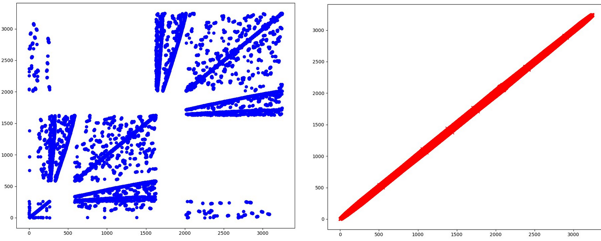

# Cuthil-Mckee Reordering

Fortran module for (Reverse) Cuchil-Mckee Reordering.

An example comparison of the nodes before and after reordering:

## Usage

The [module file](./src/cuthil_mckee.f90) has no dependencies and can be integrated directly into your workflow. It contains the following functions:

- `CM_from_list`: Returns a permutation vector as computed by the Cuthil-McKee algorithm, with connection list as argument
- `CM_from_matrix`: Returns a permutation vector as computed by the Cuthil-McKee algorithm, with adjacency matrix as argument
- `RCM_from_list` and `RCM_from_matrix`: Returns the reverse of the permutation, with the same argument of the corresponding function above

By connection list we mean a matrix, where the rows represent a cell (edge, triangle, square, etc.) and the columns represent the nodes that are forming the cell. For cells with more than 3 nodes, the node at index i should be connected to the nodes at indices i-1 and i+1. For edges and triangles, you don't need to worry about the order (they are connected anyway).

By adjacency matrix we mean a matrix, where the rows and columns represent the nodes of the graph and the values represent whether the nodes are connected or not. The matrix should be symmetric, with the diagonal being all zeros. The matrix is represented as a boolean matrix.
